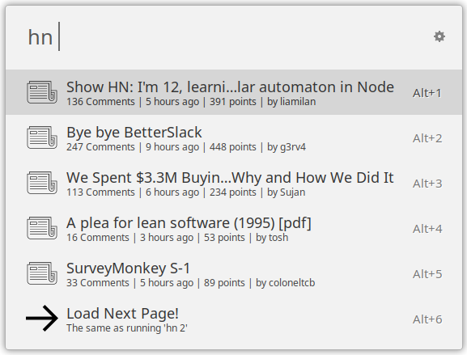
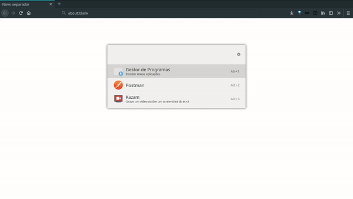

# Hackernews (ULauncher Extension)

This is an extension for [ULauncher](https://ulauncher.io/), a mac-like application launcher for linux.


## Instalation
For this extension to work, install the following modules:
```
    pip install --user timeago
    pip install --user datetime
```

## Usage



`hn ` - Shows the top stories on HN

`hn open %d` - Opens the first %d top stories in the browser. 
